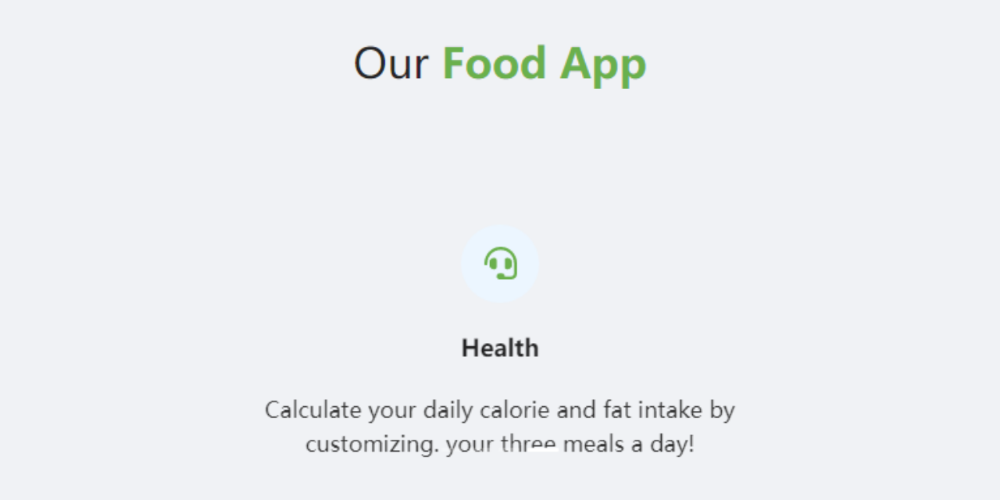
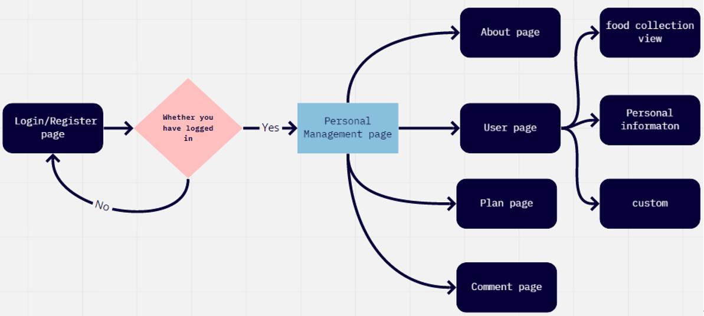
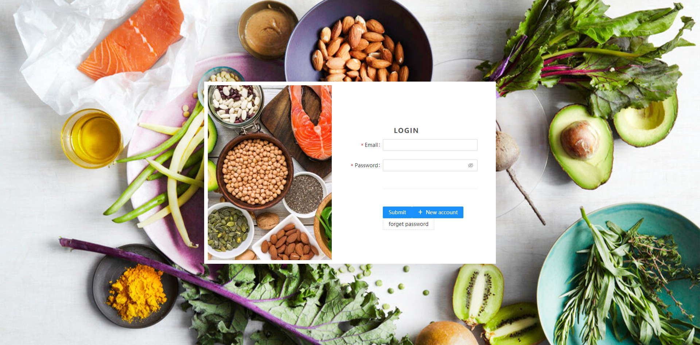
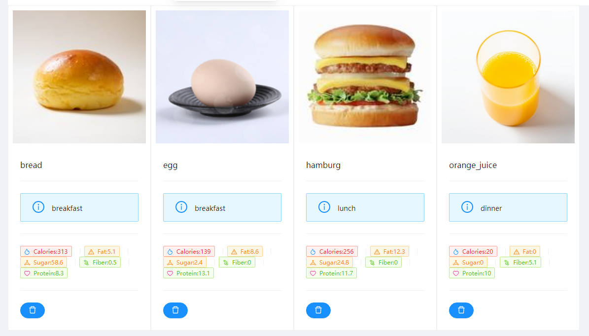
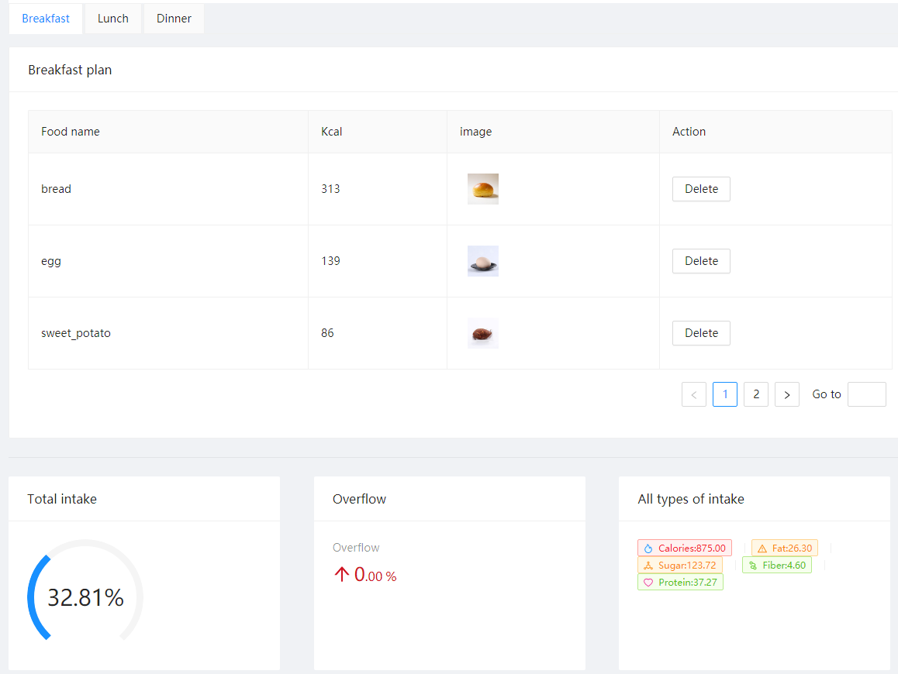
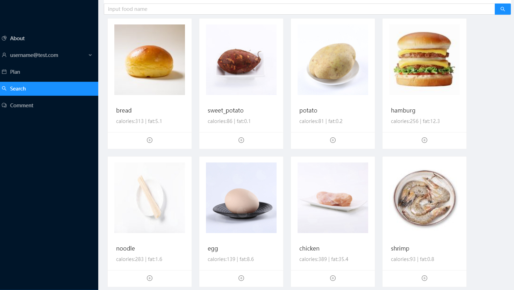

# Healthy Diet Management

## About The Project

Healthy Diet Management is a practical tool for people to get some food information and make their own breakfast, lunch, and dinner plan optionally. In this application, users can have their diet plan by themselves. When they provide some certain personal information: age, gender, height, and weight at register page. It will be advising users how many calories they should take and knowing how many fats is contained in these foods. They will have a self-selected diet for a day, and it can give users the food ingredients information and data, it can calculate the overall ingredient intake, respectively. People who want to keep fit, they can also choose and collect food items into the personal collection packet.

## Techniques used

React, JS, HTML, CSS, Less, Firebase, Google cloud virtual machine, Ant Design UI

## Flow Chart

## Home Page

Our app must log in to access the personal management page because this is a very private manager.

## Food Collection Card/Custom Card

we use the designed food cards to display the data, and in the middle of food cards, we marked the different labels with dinner, lunch, and breakfast, so that people can organize their meal separately, they also can set their own food card that we did display on the page to make their own preferences. And for designing every label, we use Ant Design UI components, which give us fancy label components that are well designed. Giving the different color on different type of data, vividly shows data on the cards.

## Daily Plan

The use table shows sample forms of food plans for breakfast, lunch, and dinner. Each shows three foods to support deletion. The image can be enlarged. We obtain food data from the user information collection list and then compare all the user’s food calories with the maximum calorie combination. If the limit is exceeded, the daily calorie percentage will be calculated and displayed below. If the limit is exceeded, it will be displayed as an excess percentage. If you delete food, the values of the next three cards will change.

## Search Information of Certain Food

The food search page is a display platform for basic data of our project. All food information will be here. The pictures of each food will be placed in a picture frame. There will be some food nutrition information below the picture. At the bottom of each picture frame is a plus button. The user can click on his favorite food or add it to his daily diet. In the plan. Above the entire page is one of the most important functions. The search box can be used for fuzzy matching according to the food name entered by the user.

## License

Distributed under the *GNU General Public License*. See `LICENSE` for more information.

## Contact

***GitHub***: https://github.com/lgw1995

***E-Mail***: liu.guowen@outlook.com